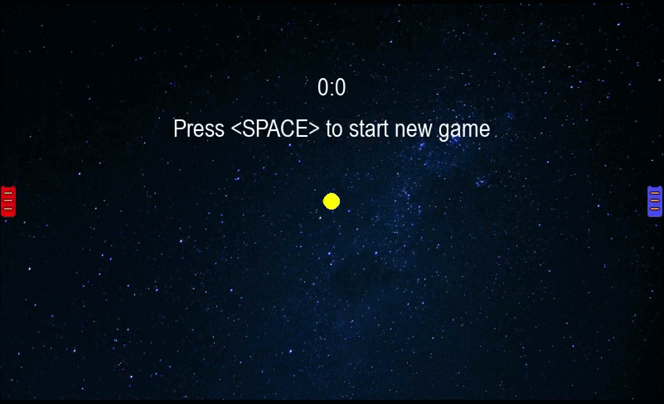

#AIR HOCKEY

## Table of contents
 - [Usage](#Usage)
 - [Rules](#Rules)
 - [Controls](#Controls)
 - [Demo gif](#Demo)

## Usage

First you should clone the project install requirements

### Windows
```bash
git clone https://github.com/Zeph1rr/airhockey.git
cd airhockey
pip install -r requirements.txt
```

### MacOS, Linux
```bash
git clone https://github.com/Zeph1rr/airhockey.git
cd airhockey
pip3 install -r requirements.txt
```

Then just start the script and enjoy the game

### Windows
```bash
python .\src\main.py
```

### MacOS, Linux
```
python ./src/main.py
```

## Rules

- Game runs until red or blue player will not win
- Win is gaining 6 points by any player
- Player gain point when circle collide with one of the horizontal borders
- You can reset game after win
- After each collision with a car accelerate

## Controls

- W, S - Red car
- Up, Down - Blue car
- Space - Start new game
- Escape - Pause

# Demo

